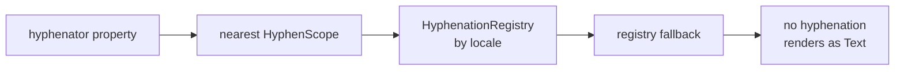

<h1 align="center">hyphenation</h1>

<p align="center">
  <em>Correct, fast, TeX-quality hyphenation for Dart and Flutter.</em>
</p>

<p align="center">
  <a href="https://pub.dev/packages/hyphenation"></a>
  <a href="https://pub.dev/packages/flutter_hyphenation"></a>
  <a href="https://github.com/arxdeus/hyphenation/issues"></a>
  
  <a href="LICENSE"></a>
</p>

<p align="center">
  <a href="#quick-start">Quick start</a> •
  <a href="#pattern-files">Patterns</a> •
  <a href="#hyphentext">HyphenText</a> •
  <a href="#the-engine">Engine</a> •
  <a href="#dangling-words">Dangling words</a> •
  <a href="#shrinking-pattern-assets">Asset transformer</a> •
  <a href="#api-reference">API</a>

</p>

---

Flutter never hyphenates. A long word that does not fit is moved to the next line whole, leaving a ragged edge or, in a narrow column, a river of white space. This repository fixes that with Liang's hyphenation algorithm and the TeX pattern files every typesetter already uses.

```text
Text                       HyphenText
┌──────────────────────┐   ┌──────────────────────┐
│ The                  │   │ The international-   │
│ internationalization │   │ ization of typogra-  │
│ of typography is a   │   │ phy is a solved      │
│ solved problem       │   │ problem              │
└──────────────────────┘   └──────────────────────┘
```

Two packages ship from this repository:

| Package | What it is | Depends on Flutter |
| --- | --- | --- |
| [`hyphenation`](packages/hyphenation) | The engine: pattern compilation, word splitting, greedy line breaking | No |
| [`flutter_hyphenation`](packages/flutter_hyphenation) | `HyphenText`, asset loading, a locale registry, a build-time asset transformer | Yes |

`flutter_hyphenation` re-exports `hyphenation`, so a Flutter app needs one dependency and one import.

## Features

- **A drop-in `Text`** - `HyphenText` extends `Text` and accepts every one of its properties, so adopting it is a rename.
- **Real hyphens** - Flutter paints nothing at a soft hyphen, so the line breaking is done here and a visible hyphen is emitted at the break.
- **Correct by construction** - Liang's algorithm over the same `hyph-*.tex` pattern files TeX, LibreOffice and browsers use. Over 80 languages are available from CTAN.
- **Fast enough to be invisible** - a warm paragraph lays out at or below the cost of a plain `Text`, because break results are memoised on the shared hyphenator.
- **Dangling word control** - keep articles, prepositions and conjunctions from being stranded at the end of a line.
- **Pure Dart engine** - use it in a CLI, a server, or a build step, with no `dart:ui` anywhere.
- **Smaller bundles** - an asset transformer strips a pattern file down to its patterns at build time, cutting up to 70% of its size.
- **Bounded memory** - every cache has a byte budget you can set or switch off.

## Quick start

### Flutter

1. Add the dependency:

   ```sh
   flutter pub add flutter_hyphenation
   ```

2. Download a pattern file into your assets. For US English, [`ushyph1.tex`](https://ctan.org/pkg/ushyph); other languages live in [hyph-utf8](https://ctan.org/pkg/hyph-utf8). Declare it in `pubspec.yaml`:

   ```yaml
   flutter:
     assets:
       - assets/patterns/ushyph1.tex
   ```

3. Register it once at startup, then use `HyphenText` anywhere:

   ```dart
   import 'package:flutter/material.dart';
   import 'package:flutter_hyphenation/flutter_hyphenation.dart';

   Future<void> main() async {
     WidgetsFlutterBinding.ensureInitialized();
     await HyphenationRegistry.instance.registerAsset(
       const Locale('en', 'US'),
       'assets/patterns/ushyph1.tex',
     );
     runApp(const MyApp());
   }

   // ...anywhere in the tree:
   const HyphenText(
     'Internationalization is a remarkably long word.',
     style: TextStyle(fontSize: 20),
   );
   ```

> [!TIP]
> Registering at startup is all the plumbing an app needs. Until a pattern set is registered, `HyphenText` renders exactly like `Text`, so it is safe to build the UI before loading finishes.

### Dart

```sh
dart pub add hyphenation
```

```dart
import 'dart:io';
import 'package:hyphenation/hyphenation.dart';

void main() async {
  final hyphenator = Hyphenator.fromSource(
    await File('ushyph1.tex').readAsString(),
  );

  hyphenator.split('hyphenation');        // [hy, phen, ation]
  hyphenator.breakOffsets('hyphenation'); // [2, 6]
  hyphenator.hyphenate('hyphenation');    // hy<SHY>phen<SHY>ation
}
```

Run the full tour with `dart run example/example.dart` from `packages/hyphenation`.

## Pattern files

A pattern file is data, not code. It is a plain TeX file holding a `\patterns{...}` group, and optionally a `\hyphenation{...}` group of explicit exceptions:

```tex
\patterns{
hy3phen
hyphen5ation
an3ti
}
\hyphenation{
man-u-script
}
```

Get them from CTAN:

| Language | File | Source |
| --- | --- | --- |
| English (US) | `ushyph1.tex` | [ushyph](https://ctan.org/pkg/ushyph) |
| English (US, extended) | `ushyphmax.tex` | [ushyphmax](https://ctan.org/pkg/hyphenation) |
| 80+ others | `hyph-<lang>.tex` | [hyph-utf8](https://ctan.org/pkg/hyph-utf8) |

> [!IMPORTANT]
> No pattern file is bundled with either package, and each one carries its own license. Check the notice in the file you ship. `ushyph1.tex` permits unlimited unmodified redistribution; `ushyphmax.tex` permits modification provided its notice is preserved. See [NOTICE.md](NOTICE.md) for details.

## HyphenText

`HyphenText` extends `Text`, so it takes `style`, `textAlign`, `maxLines`, `overflow`, `semanticsLabel` and the rest unchanged. Three properties are its own:

| Property | Default | What it does |
| --- | --- | --- |
| `hyphenator` | `null` | Use this pattern set, overriding the scope and the registry |
| `hyphenCharacter` | `'-'` | The character painted at a break |
| `hyphenate` | `true` | Set to `false` to behave exactly like `Text` |

```dart
HyphenText(
  'antidisestablishmentarianism',
  hyphenCharacter: '\u2010', // a real hyphen, not a hyphen-minus
  style: const TextStyle(fontSize: 24),
)
```

### Where the pattern set comes from

Resolution runs in this order, and the first hit wins:



Use `HyphenScope` to override one subtree, or to switch hyphenation off for it:

```dart
HyphenScope(
  hyphenator: germanHyphenator,
  child: const HyphenText('Donaudampfschifffahrtsgesellschaft'),
)

HyphenScope(
  hyphenator: null, // this subtree renders as plain Text
  child: const HyphenText('code_identifiers_stay_intact'),
)
```

### Registering more than one language

```dart
await HyphenationRegistry.instance.registerAsset(
  const Locale('en', 'US'),
  'assets/patterns/ushyph1.tex',
);
await HyphenationRegistry.instance.registerAsset(
  const Locale('de'),
  'assets/patterns/hyph-de-1996.tex',
);
```

`HyphenText` then picks the pattern set matching the ambient `Localizations` locale, or the one named by its own `locale` property. The first set registered also becomes the fallback for unmatched locales, so a single-language app needs no locale plumbing at all.

> [!NOTE]
> `HyphenText.rich` renders its span exactly as `Text.rich` does. Splitting a word across styled spans would move their boundaries, so rich text is deliberately left alone. The constructor exists so `HyphenText` remains a complete stand-in for `Text`.

## The engine

`package:hyphenation` is pure Dart and works in a CLI, on a server, or in a build step.

### Hyphenator

```dart
final hyphenator = Hyphenator.fromSource(
  source,
  leftMin: 2,        // characters that must stay before a break
  rightMin: 3,       // characters that must move to the next line
  minWordLength: 5,  // shorter words are never hyphenated
  maxCacheSize: 5000,
);

hyphenator.split('typography');            // [ty, pog, ra, phy]
hyphenator.breakOffsets('typography');     // [2, 5, 7]
hyphenator.hyphenate('typography');        // soft hyphens inserted
hyphenator.hyphenate('typography', separator: '-'); // ty-pog-ra-phy
hyphenator.hasBreakOpportunity(paragraph); // cheap pre-check
```

A `Hyphenator` is cheap to keep around and memoises what it sees, so share one instance across the app. Several hyphenators with different settings can share one compiled `TexHyphenationPatterns`, which avoids a second compile:

```dart
final patterns = TexHyphenationPatterns.parse(source);
final prose = Hyphenator(patterns, leftMin: 3);
final captions = Hyphenator(patterns, leftMin: 2, minWordLength: 4);
```

### Line breaking

`HyphenLineBreaker` turns hyphenation points into lines. It is greedy, the way browsers are for `hyphens: auto`: each line takes the longest prefix that fits, preferring a whole word and falling back to a part of one. It needs one thing the package cannot supply, a way to measure painted text:

```dart
final breaker = HyphenLineBreaker(
  measure: (text) => textPainter.measure(text),
  hyphenator: hyphenator,
  hyphenCharacter: '-',
);

breaker.breakText('antidisestablishmentarianism is long', 140);
// [antidisestablishmen-, tarianism is long]

breaker.breakIntoString(text, 140); // the same, joined with newlines
breaker.minIntrinsicWidth(text);    // widest unbreakable part
```

In Flutter this is all handled for you: `HyphenText` builds the breaker, measures with the real text engine, and shares results across widgets.

## Dangling words

A short word stranded at the end of a line reads badly, and in some languages it is a typographic error. Give the hyphenator a word list and the line breaker stops offering a break after any of them, carrying the word down with the word it belongs to:

```dart
final hyphenator = await HyphenationRegistry.instance.registerAsset(
  const Locale('en', 'US'),
  'assets/patterns/ushyph1.tex',
  danglingWords: {'a', 'an', 'the', 'of', 'in', 'to', 'and', 'or'},
);
```

```text
without danglingWords     with danglingWords
┌─────────────────────┐   ┌─────────────────────┐
│ send the report to  │   │ send the report     │
│ the manager and the │   │ to the manager      │
│ team lead           │   │ and the team lead   │
└─────────────────────┘   └─────────────────────┘
```

Nothing is inserted into the text: the string that gets painted is the one you passed in. The list is compiled into an allocation-free probe table, so it costs nothing measurable on the hot path.

> [!NOTE]
> No list ships with the package. Which words to keep with their neighbour is an editorial choice that varies by language and house style. The [example app's list](example/lib/constant/dangling_words.dart) is a reasonable starting point for English.

## Shrinking pattern assets

A `hyph-*.tex` file from CTAN is mostly prose: a license header, a changelog, `\message{...}`, `\endinput`. None of it survives compilation, but all of it ships in your bundle and is scanned at startup. `flutter_hyphenation` includes an asset transformer that strips a file to its pattern groups at build time:

```yaml
flutter:
  assets:
    - path: assets/patterns/ushyph1.tex
      transformers:
        - package: flutter_hyphenation
          args: ['--keep-header', '--verbose']
```

The output is still an ordinary pattern file that parses back identically.

| Option | Default | Purpose |
| --- | --- | --- |
| `--layout=lines\|wrapped` | `lines` | One token per line, or wrapped to `--width` |
| `--width=<n>` | `80` | Line width for `--layout=wrapped` |
| `--drop-exceptions` | off | Omit the `\hyphenation` group |
| `--keep-header` | off | Copy the source file's leading comments through |
| `--verbose` | off | Report the bytes saved |

Measured against current hyph-utf8 files: 70% smaller for `hyph-fr.tex`, 67% for `hyph-it.tex`, and 1% for `hyph-de-1996.tex`, which already stores one pattern per line.

> [!IMPORTANT]
> Most pattern licenses ask that the notice be preserved. Pass `--keep-header` to copy the source file's leading comments through verbatim.

## Performance and memory

Every cache is bounded, and each bound can be set or switched off:

| Option | Default | Bounds |
| --- | --- | --- |
| `maxCacheSize` | `5000` | Words memoised; `0` disables all caching |
| `maxParagraphCacheSize` | `200` | Paragraph-sized results |
| `maxParagraphCacheBytes` | `1 MiB` | Estimated retained bytes per paragraph cache |
| `maxCachedWordLength` | `256` | Long tokens are processed but not retained |

```dart
Hyphenator.fromSource(source, maxCacheSize: 0); // no caching at all
hyphenator.cacheEstimatedBytes;                 // what it is holding now
hyphenator.clearCache();                        // drop it
```

`hyphenator.toString()` names the pattern set and reports cache occupancy, and `HyphenText` hands it to the widget inspector, so both are visible in DevTools.

Benchmarks live in each package's `benchmark/` directory and run on [`bench_press`](https://pub.dev/packages/bench_press):

```sh
cd packages/hyphenation && dart run benchmark/tex_engine_benchmark.dart
cd packages/flutter_hyphenation && flutter test benchmark/text_layout_benchmark.dart
```

## Running the example

The example app shows `Text` and `HyphenText` side by side with live width and font-size sliders, the lines each one actually paints, and the break points for a few words.

```sh
git clone https://github.com/arxdeus/hyphenation.git
cd hyphenation
dart pub get          # a pub workspace: resolves all three packages
cd example && flutter run
```

## How it works

The engine implements Liang's hyphenation algorithm, from Franklin Mark Liang's 1983 Stanford dissertation *Word Hy-phen-a-tion by Com-put-er*, the same algorithm TeX has used since.

1. **Compile.** Patterns are read straight from the file's code units into a trie held in flat typed arrays, never assembled into strings. Wide nodes get a direct dispatch table spanning their own range of code units; narrow ones keep a binary search, which is faster than a sparse table's cache miss.
2. **Mark.** Every substring of the word, bracketed with `.`, is looked up in the trie. Each pattern contributes digits between characters, the highest digit at each position wins, and an odd digit means a legal break.
3. **Break.** The widget stack hands those positions to `HyphenLineBreaker`, which measures candidates against the column width, aiming its search with the running average of the widths it has already measured, so a line costs two or three measurements rather than a blind binary search.
4. **Paint.** The chosen lines are re-emitted with real hyphens and handed to the text engine, and the result is memoised on the shared hyphenator under a key covering everything that moves the lines: width, style, scaler, strut, direction and locale.

> [!NOTE]
> The algorithm and the TeX pattern format are both public, and no third-party source is incorporated, so both packages are MIT throughout. Pattern files remain data with their own licenses.
